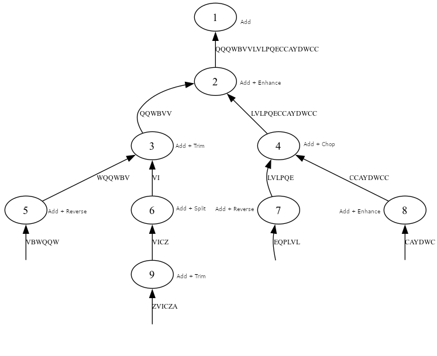

# CMPE300 Project 2 
## Introduction
In this project, we implemented a digital twin that simulates the provided factory environment using parallel programming. For this, we used the mpi4py module of python, an implementation of OpenMPI library. The given factory specification consists of operations done on products of strings, and each machine is a different thread that runs in parallel with other machines. These machines are organized in a tree structure, with each children passing their products to their parents, and the output of the root machine is the final product.
### Why Parallel Programming?
The twin needs to emulate the factory at each production cycle, where in each production cycle is many machines, represented by a piece of code. At each step, all machines must execute corresponding code. By now it should be obvious that doing such a task in a single process will take a great amount of time, and the time complexity of the program is almost completely dependent on the number of machines. So, it is a far better way to implement this program in parallel, where each process corresponds to either a machine, or one control process responsible for overall organization.
Implementing dependencies between child machines would be harder without using parallelizations as well. In our approach, simple non-blocking messeages are enough to implement this behaviour. Another approach could be using priority queues and implementing a discrete event simulation. But of course this would be harder.

## Code Logic
### Modules
The code consists of three modules: a control and I/O module, a module that implements the logic for the machines, and a module that implements the operations to be used by machines.
#### ioctl.py
This module is responsible for:
- Reading from input and writing to output
- Spawning required machine processes
- Broadcasting control signals to these machines such as: Initial operations & initial products and production cycle number 

#### machine.py
This module is responsible for the main machine logic. The machines all start by obtaining system information from the system and then program information from ioctl. Then, as defined by the factory specification, their operations are selected by their 'Machine Id': Reverse and Trim for machines with odd IDs; Enhance, Split and Chop for machines with even IDs. Here, to ensure correspondence between specified machine IDs and thread IDs generated by OpenMPI, we spawn an extra thread and only use threads from 1-N (meaning that thread 0 is never used). 

The machines then receive the production cycle. The respective operation is determined by the production cycle (defined in the order provided above): The operation alternates in order between each other by different production cycles. Then, the machines produce the product from received products, passes it to the next machine, logs maintenance costs and sends a 'work done' signal. 
#### operations.py
This module implements an interface for string operations, for more convenient use in machine.py.

### Execution Logic
The program starts by reading the input file provided as an argument to the program. I/O control module initializes all the machines, broadcasts system-wide information to the machines (such as wear factors and maintenance threshold), sends machine-specific data (initial operations, initial products etc.) to each machine, and then sends the production cycle.

Each machine waits for the production cycle signal. Then, by the production cycle, each machine determines which operation to apply to received products. Each machine, then, waits completion of production by each children (as expected, leaf machines will not wait anything). Then, each machine first applies add operation on all of the received products in order of increasing children ID (leaf machines will not do anything). Then the machines will apply the determined operation on this intermediate product, and then will pass it on to their parent machine. 

After production is done, each machine calculates an accumulated wear. When this accumulated wear exceeds maintenance threshold, a machine will log the maintenance cost and the given production cycle. Finally, the machine will send a 'work done' signal to the I/O control module. 

After every machine sends their signal to the I/O control module, the module will output the final product and broadcast the next production cycle for all production cycles.
## Example


Here, this graph shows the first production cycle for the given input:

```
2 1 enhance
3 2 trim
4 2 chop
5 3 reverse
6 3 split
7 4 reverse
8 4 enhance
9 6 trim
VBWQQW
EQPLVL
CAYDWC
ZVICZA
```
The leaf machines 5, 7, 8 and 9 receive inputs and immediately process them. The rest of the machines will have to wait until products of each children are complete. 
## Bonus: Implementation Challenges
While a digital twin is quite useful in simulating the factory environment, there are challenges associated to implementing such a model for a real process:
- Model flexibility: A digital twin is tailor-fit to the process it represents, so a need to update the twin will arise whenever the corresponding process is updated. This may require dedicated personnel to keep the twin up-to-date.
- Model representation: The digital twin will work only as good as the model approximates the process. For instance, given model in this project assumes that any wear out is fixed instantly. This is not a realistic assumption and in the real case, the machine would have to stay idle until it is repaired.
- Process uncertainty: In general, a digital twin may fail to capture any uncertainty or any unexpected event regarding the process. For instance, this twin cannot represent random break-downs for machines. In general, a digital twin may fail to take into account random variables in the environment.

Overall, if this project was a real implementation of a digital twin, we would need to be careful in carefully designing the twin and its relation to the physical twin; we would need to make sure that it represents the factory as good as it fits our aim, we would need to take into account any flexibility in the underlying process and we would need to accustom for any random variables that could disrupt the industrial process.
## Conclusion
In this project, we have utilized parallel programming to implement a digital twin of the provided factory specification. This project has been a great introduction for us in parallel programming and inter-process communication. 